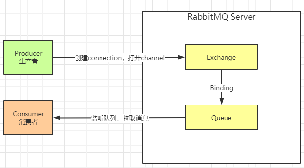

# rabbitmq-mail
使用rabbitmq统一发送邮件案例

## rabbitmq特性
+ 可靠性。支持持久化，传输确认，发布确认等保证了MQ的可靠性。
+ 灵活的分发消息策略。这应该是RabbitMQ的一大特点。在消息进入MQ前由Exchange(交换机)进行路由消息。分发消息策略有：简单模式、工作队列模式、发布订阅模式、路由模式、通配符模式。
+ 支持集群。多台RabbitMQ服务器可以组成一个集群，形成一个逻辑Broker。
+ 多种协议。RabbitMQ支持多种消息队列协议，比如 STOMP、MQTT 等等。
+ 支持多种语言客户端。RabbitMQ几乎支持所有常用编程语言，包括 Java、.NET、Ruby 等等。

## 相关名词
+ Broker：消息队列服务进程。此进程包括两个部分：Exchange和Queue。
+ Exchange：消息队列交换机。按一定的规则将消息路由转发到某个队列。
+ Queue：消息队列，存储消息的队列。
+ Producer：消息生产者。生产方客户端将消息同交换机路由发送到队列中。
+ Consumer：消息消费者。消费队列中存储的消息。

## Exchange（交换机）详解
Exchange相当于邮递员，Exchange（邮递员）拿到生产者产生的数据（信）之后，会根据routing key（信封上的小区门牌号），将这份数据（信）放到数据队列（信箱）里面，消费者（收件人）看到队列（信箱）里面有数据（信），则可以拿到数据消费（拿到信查看）
Exchange有四种模式
1. Direct Exchange,这个模式需要routing key完全匹配，才能正确的发送数据。
2. Fanout Exchange,这个模式下，交换机会将消息发送到所有与其绑定的队列上，类似广播
3. Topic Exchange,这个模式下，交换机会根据通配符的方式来进行匹配，通配符有两种："*" 、 "#"。通配符前面必须要加上"."符号
    + `*` 符号：有且只匹配一个词。比如 user.*可以匹配到"a.name"、"a.age"，但是匹配不了"user.name.firstname"。
    + `#` 符号：匹配一个或多个词。比如"rabbit.#"既可以匹配到"rabbit.a.b"、"rabbit.a"，也可以匹配到"rabbit.a.b.c"。
4. Headers Exchange,它的路由不是用routingKey进行路由匹配，而是在匹配请求头中所带的键值进行路由