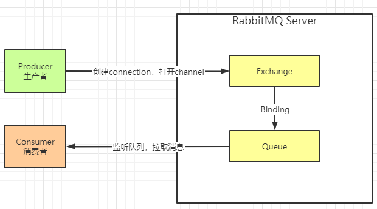
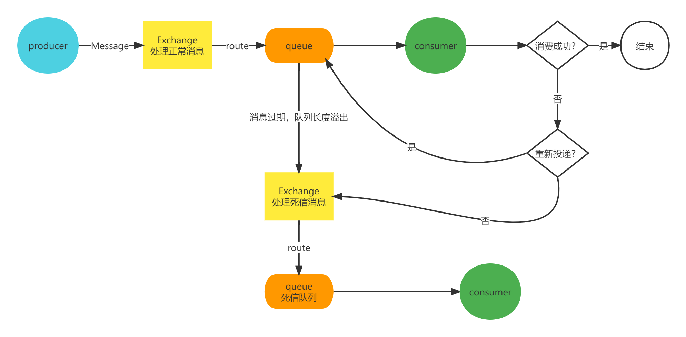

# rabbitmq-mail

使用rabbitmq统一发送邮件案例

## rabbitmq特性

+ 可靠性。支持持久化，传输确认，发布确认等保证了MQ的可靠性。
+ 灵活的分发消息策略。这应该是RabbitMQ的一大特点。在消息进入MQ前由Exchange(交换机)进行路由消息。分发消息策略有：简单模式、工作队列模式、发布订阅模式、路由模式、通配符模式。
+ 支持集群。多台RabbitMQ服务器可以组成一个集群，形成一个逻辑Broker。
+ 多种协议。RabbitMQ支持多种消息队列协议，比如 STOMP、MQTT 等等。
+ 支持多种语言客户端。RabbitMQ几乎支持所有常用编程语言，包括 Java、.NET、Ruby 等等。

## 相关名词

+ Broker：消息队列服务进程。此进程包括两个部分：Exchange和Queue。
+ Exchange：消息队列交换机。按一定的规则将消息路由转发到某个队列。
+ Queue：消息队列，存储消息的队列。
+ Producer：消息生产者。生产方客户端将消息同交换机路由发送到队列中。
+ Consumer：消息消费者。消费队列中存储的消息。
+ 

**生产者主要是和交换机打交道，消费者主要是和队列打交道**

## Exchange（交换机）详解

Exchange相当于邮递员，Exchange（邮递员）拿到生产者产生的数据（信）之后，会根据routing key（信封上的小区门牌号），将这份数据（信）放到数据队列（信箱）里面，消费者（收件人）看到队列（信箱）里面有数据（信），则可以拿到数据消费（拿到信查看）
Exchange有四种模式

1. Direct Exchange,这个模式需要routing key完全匹配，才能正确的发送数据。[com.rabbitmq.direct](https://github.com/jinkangHe/rabbitmq-mail/blob/026146d0699735de0f0e1dbc57f8f637efe0d8bd/src/main/java/com/rabbitmq/direct)
2. Fanout Exchange,这个模式下，交换机会将消息发送到所有与其绑定的队列上，类似广播 [com.rabbitmq.fanout](https://github.com/jinkangHe/rabbitmq-mail/blob/026146d0699735de0f0e1dbc57f8f637efe0d8bd/src/main/java/com/rabbitmq/fanout)
3. Topic Exchange,这个模式下，交换机会根据通配符的方式来进行匹配，通配符有两种："*" 、 "#"。[com.rabbitmq.topic](https://github.com/jinkangHe/rabbitmq-mail/blob/026146d0699735de0f0e1dbc57f8f637efe0d8bd/src/main/java/com/rabbitmq/topic)
   + `*` 符号：有且只匹配一个词。比如 user.*可以匹配到"user.name"、"user.age"，但是匹配不了"user.name.firstname"。
   + `#` 符号：匹配一个或多个词。比如"rabbit.#"既可以匹配到"rabbit.a.b"、"rabbit.a"，也可以匹配到"rabbit.a.b.c"。
4. Headers Exchange,它的路由不是用routingKey进行路由匹配，而是在匹配请求头中所带的键值进行路由 [com.rabbitmq.headers](https://github.com/jinkangHe/rabbitmq-mail/blob/026146d0699735de0f0e1dbc57f8f637efe0d8bd/src/main/java/com/rabbitmq/headers)

## 编码实现

1. 创建交换机Exchange
2. 创建队列 Queue
3. 将交换机和队列绑定 Binding

#### 配置

这里以Direct Exchange模式为例。

```java

import org.springframework.amqp.core.*;
import org.springframework.context.annotation.Bean;
import org.springframework.context.annotation.Configuration;

/**
 * @author Jinkang He
 * @version 1.0
 * @date 2022/3/23 13:54
 * 声明一个队列 一个交换机 然后将两者绑定到一起 durable 表示持久化 重启之后exchange不消失
 */

@Configuration
public class DirectExchangeConfig {
    //创建一个directExchange
    @Bean("directExchange")
    public Exchange directExchange(){
        //设置exchange的name 发送消息的时候可以指定
        return ExchangeBuilder.directExchange("directExchange").durable(true).build();
    }

    //创建一个队列绑定到创建一个directExchange
    @Bean("queueA")
    public Queue queueA() {
        return QueueBuilder.durable("queueA").build();
    }

    //将两者绑定到一块并设置routing key
    @Bean
    public Binding bindingBuilder(Queue queueA,DirectExchange directExchange){
        return BindingBuilder.bind(queueA).to(directExchange).with("spring");
    }
}

```

#### 生产消费

```java
import org.slf4j.Logger;
import org.slf4j.LoggerFactory;
import org.springframework.amqp.rabbit.annotation.RabbitListener;
import org.springframework.amqp.rabbit.core.RabbitTemplate;
import org.springframework.beans.factory.annotation.Autowired;
import org.springframework.messaging.Message;
import org.springframework.scheduling.annotation.Scheduled;
import org.springframework.stereotype.Component;

import java.util.UUID;

/**
 * @author Jinkang He
 * @version 1.0
 * @date 2022/3/23 14:20
 */
@Component
public class DirectTask {
    private static final Logger logger = LoggerFactory.getLogger(DirectTask.class);

    //主要通过RabbitTemplate提供的API
    @Autowired
    RabbitTemplate rabbitTemplate;
    //使用定时任务向消息队列发送消息
    @Scheduled(cron = "*/5 * * * * ?")
    public void producer() {
        String suffix = UUID.randomUUID().toString();
        //实验组
        logger.info("DirectTask发送消息: {}",suffix);
        rabbitTemplate.convertAndSend("directExchange","spring","spring类型消息" + suffix);
        //对照组
        rabbitTemplate.convertAndSend("directExchange","summer","spring类型消息" + suffix);
    }
    //消费者监听指定的队列
    @RabbitListener(queues = {"queueA"})
    public void consumer(Message message){
        logger.info("consumer收到消息：{}" , message.getPayload());
    }

}
```

配置手动确认

`spring.rabbitmq.listener.simple.acknowledge-mode = true`

核心代码：

```java
//确认 第二个参数表示是否开启批量确认 如果开启则会批量确认所有小于当前deliveryTag的消息
channel.basicAck(message.getMessageProperties().getDeliveryTag(), false);
//拒绝 第二个参数表示是否重新投递到队列 重试 
channel.basicReject(message.getMessageProperties().getDeliveryTag(), true);
```

```java
    @RabbitListener(queues = {"queueA"})
    public void consumer(Message message, Channel channel) {
        if (Math.random() > 0.45) {
            logger.info("consumer收到消息：{}", new String(message.getBody()));
            try {
                channel.basicAck(message.getMessageProperties().getDeliveryTag(), false);
            } catch (IOException e) {

                e.printStackTrace();
            }
        } else {
            //
            try {
                channel.basicReject(message.getMessageProperties().getDeliveryTag(), true);
            } catch (IOException e) {
                e.printStackTrace();
            }
            logger.error("{}消息未消费", new String(message.getBody()));
        }
    }
```

### 死信交换机

死信交换机，Dead-Letter-Exchange 即 DLX。

死信交换机用来接收死信消息（Dead Message）的，那什么是死信消息呢？一般消息变成死信消息有如下几种情况：

* 消息被拒绝(Basic.Reject/Basic.Nack) ，井且设置requeue 参数为false（即不会再重新投递到原来的队列）
* 消息过期
* 队列达到最大长度

当消息在一个队列中变成了死信消息后，此时就会被发送到 DLX，绑定 DLX 的消息队列则称为死信队列。

DLX 本质上也是一个普普通通的交换机，我们可以为任意队列指定 DLX，当该队列中存在死信时，RabbitMQ 就会自动的将这个死信发布到 DLX 上去，进而被路由到另一个绑定了 DLX 的队列上（即死信队列）



配置：

创建队列的时候传入参数**x-dead-letter-exchange**属性即可指定该队列的消息成为死信消息之后发送到哪个交换机。

同时也可以使用**x-dead-letter-routing-key**指定routeingKey

[com.rabbitmq.dlx](https://github.com/jinkangHe/rabbitmq-mail/blob/026146d0699735de0f0e1dbc57f8f637efe0d8bd/src/main/java/com/rabbitmq/dlx)

```java
 @Bean("normalQueue")
    public Queue normalQueue() {
        return QueueBuilder.durable("normalQueue")
                .withArgument("x-dead-letter-exchange", "dlxExchange") //指定死信发送到哪个交换机（相当于绑定一个死信交换机）
                .withArgument("x-dead-letter-routing-key", "dlx")
                .build();
    }
```
